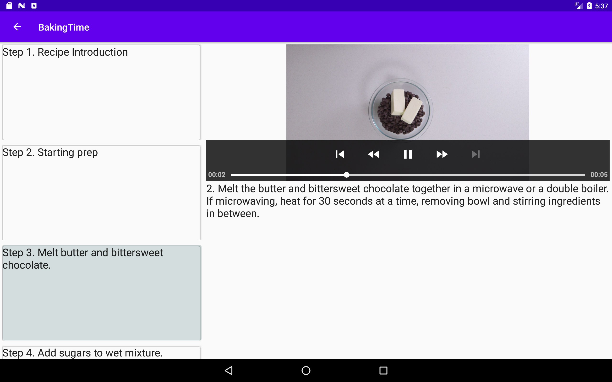

# Baking Time

<table>
<tr>
<td></td>
<td></td>
<td></td>
</tr>

<tr>
<td>Widget</td>
<td>Master View</td>
<td>Detail Recipe View</td>
</tr>
</table>

This is an Android application to show Recipes.

## Getting Started

1. Open the project in AndroidStudio to build.
